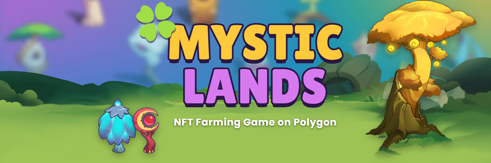

# 🍀 MysticLands

**NFT farming game on Polygon** · grow mystical plants, protect your land from the Blightweeds and earn **ML**.

---

### 🌱 What is MysticLands?

The Great Wither drained the magic out of the lands. Players restore their farms by planting NFT plants and
Mother Trees, watering them, keeping the crows away and surviving the weather of each season — harvesting
**Light Energy** that can be exchanged for the **ML** token.

- 🌿 **40 plant species + 4 Mother Trees**, 3 variants each, 8 elements and 8 classes
- 🌦️ **Living world** — weather follows the real season of your hemisphere
- 🛒 **Economy** — shop, seeds, bundles, marketplace and the community **World Tree**
- 🎯 **Daily missions** and **weekly ranking**
- 🔐 **Wallet sign-in** with MetaMask — no password, no gas
- 📱 **Installable PWA** in Portuguese, English and Spanish

### 🛠️ Built with

### 🗺️ Roadmap

- [x] Full game loop, PWA and three languages
- [x] Backend with wallet login and server-side game state
- [x] Smart contracts: ML token, Plant & Land NFTs, Seed Shop (Chainlink VRF), Marketplace
- [ ] Testnet launch on Polygon Amoy
- [ ] External audit and Polygon mainnet

### 📬 Contact

📧 contato@mysticlands.online · 🤝 parcerias@mysticlands.online · 🛡️ security@mysticlands.online
